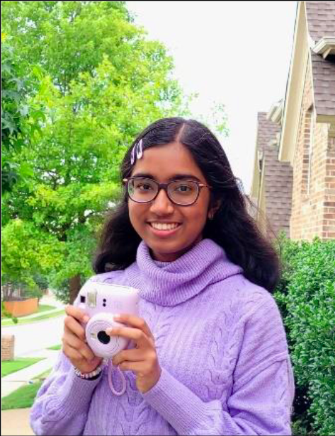

Hello! I'm Sai Kasiraman, and I love space to bits. As a kid, I loved seeing Chris Hadfield on the ISS, panning through space visualizations, and playing the little space edutainment games on NASA's website. Now that I'm older, I have a lot of scientific interest in astronomy and astrophysics. I first learned about variable stars through Science Olympiad and fell in love. Now, I'm pursuing the creation of a computational model to describe the behavior of these awesome stars. Their diversity and wide range of applications enthralls me, and I hope to share some of that joy with you through this website.

